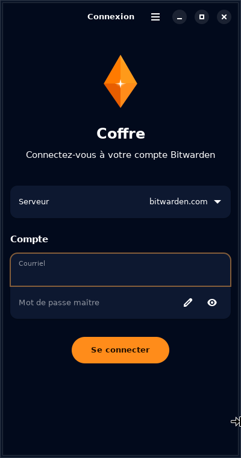
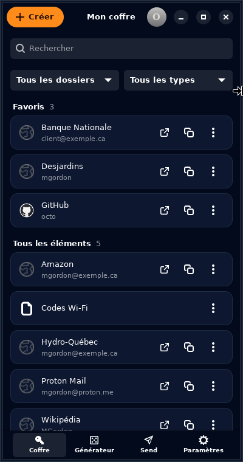
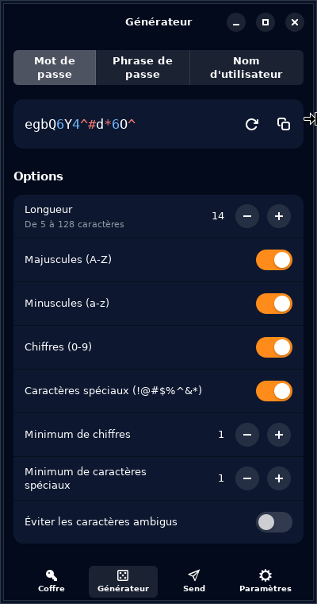
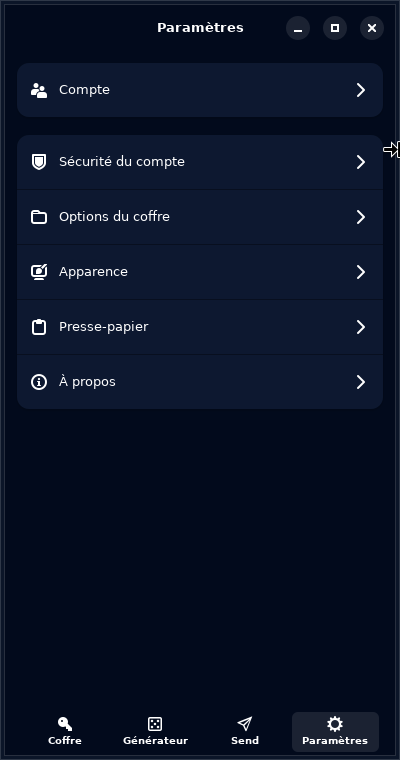

# Coffre

Client Bitwarden adaptatif pour **Phosh** (téléphones Linux) et GNOME, écrit en Rust avec
GTK4 et libadwaita. Compatible avec **bitwarden.com**, **bitwarden.eu** et les serveurs
**auto-hébergés** (Bitwarden, Vaultwarden).

> Projet non officiel, sans lien avec Bitwarden Inc.

| Connexion | Coffre | Générateur | Paramètres |
|---|---|---|---|
|  |  |  |  |

## Architecture

| Couche | Technologie |
|---|---|
| Interface | GTK4 4.14+, libadwaita 1.5+ (`AdwNavigationView`, pages adaptatives dès 360 px) |
| Authentification, synchro, crypto | [SDK officiel Bitwarden](https://github.com/bitwarden/sdk-internal) (`bitwarden-core`, `bitwarden-vault`, `bitwarden-crypto`) |
| Réseau asynchrone | Tokio (le SDK utilise reqwest) |

L'UX s'inspire de l'application Android officielle
([bitwarden/android](https://github.com/bitwarden/android), Kotlin/Compose).

### Licence du SDK

Les crates de `sdk-internal/crates/` sont sous double licence
`GPL-3.0-only OR LicenseRef-Bitwarden-SDK`. Coffre les utilise **sous l'option GPL-3.0** et est
donc lui-même distribué sous **GPL-3.0-only**. Les crates de `bitwarden_license/` (licence SDK
seule) ne sont pas utilisées. Le SDK n'étant pas publié sur crates.io, il est tiré du dépôt Git
à un commit fixé dans `Cargo.toml`.

### Sécurité

- Les éléments du coffre sont stockés **chiffrés** dans la base SQLite du SDK
  (`~/.local/share/coffre/vault.sqlite`, dossier en droits 0700) ; les clés déchiffrées
  ne vivent qu'en mémoire, dans le `KeyStore` du SDK.
- Cette base contient aussi les jetons d'accès et de rafraîchissement (comme le CLI
  officiel) : ils permettent de synchroniser, mais pas de déchiffrer le coffre sans le
  mot de passe maître.
- Expiration de la session après 5 minutes d'inactivité par défaut (délai et action,
  verrouiller ou se déconnecter, réglables) ; au redémarrage, l'application
  s'ouvre verrouillée et se déverrouille localement, sans réseau.
- Le NIP n'est gardé qu'en mémoire (oublié à la fermeture) et désactivé après 5 essais
  infructueux, comme l'option par défaut des clients officiels.
- Le presse-papier est vidé 30 secondes après une copie (délai réglable).
- La déconnexion efface toutes les données locales.

## Fonctionnalités (v0.5)

- [x] Connexion par mot de passe maître (bitwarden.com, .eu, auto-hébergé)
- [x] 2FA : application d'authentification, courriel, **clé de sécurité FIDO2 (USB ou NFC)**
  et **YubiKey OTP (USB)**
- [x] Session conservée et coffre consultable hors ligne ; déverrouillage par NIP
- [x] Interface à onglets (Coffre, Générateur, Send, Paramètres), inspirée de
  l'extension Bitwarden
- [x] Coffre : recherche, filtres par dossier et par type, favoris, icônes des sites,
  copie rapide, archive, corbeille (restauration, suppression définitive)
- [x] Création et modification d'identifiants et de notes sécurisées (dossier, favori)
- [x] Dossiers, import (Bitwarden JSON, KeePass) et export (JSON, CSV, JSON protégé)
- [x] Générateur de mots de passe, de phrases de passe et de noms d'utilisateur
- [x] Send texte (lien, durée, nombre d'accès, mot de passe)
- [x] Appareils du compte, phrase d'empreinte
- [x] Thème clair ou sombre, mode compact, délais d'expiration et du presse-papier

Limites connues : pas de SSO ni Duo ; l'option « se souvenir de cet
appareil » de la 2FA n'est pas exposée par le SDK (la 2FA n'est toutefois demandée qu'à
la première connexion) ; seuls les identifiants et les notes sécurisées sont modifiables ;
pas de pièces jointes ni de Send de fichier.

## Clés de sécurité (2FA)

| Méthode | USB | NFC |
|---|---|---|
| Clé FIDO2 / WebAuthn (YubiKey 5, SoloKey, Nitrokey, Google Titan…) | ✅ | ✅ lecteur PC/SC, ou puce intégrée par démon NCI |
| YubiKey OTP (code de 44 caractères) | ✅ la clé saisit le code | ❌ |

- **USB** : brancher la clé au port USB-C (OTG) du téléphone, puis la toucher quand elle
  clignote. Le paquet dépend de `libfido2-udev`, dont les règles udev donnent l'accès
  aux clés à l'utilisateur connecté. Si la clé n'est pas détectée (système sans logind),
  ajouter l'utilisateur au groupe `plugdev` : `doas adduser $USER plugdev`, puis se
  reconnecter.
- **NFC, lecteur PC/SC** : installer `doas apk add pcsc-lite ccid`, puis
  `doas rc-update add pcscd && doas rc-service pcscd start` (ou
  `systemctl enable --now pcscd`). Fonctionne avec les lecteurs NFC reconnus par PC/SC
  (ACR122U, etc.).
- **NFC, puce intégrée du téléphone** : la puce NFC des téléphones Linux n'est pas
  exposée par PC/SC. **Sans `pcscd`, Coffre se replie automatiquement** sur le socket
  d'un démon NFC qui relaie les trames NCI (`/run/a5y17lte-nfc/nci.sock`, ou
  `COFFRE_NCI_SOCKET`) et pilote lui-même l'activation ISO-DEP et CTAP-sur-NFC. Le
  relais à intégrer au démon, son protocole et le guide pour le Galaxy A5 2017
  (`a5y17lte-nfcd`) sont dans [`contrib/nci-bridge/`](contrib/nci-bridge/README.md).
  L'utilisateur doit être membre du groupe `nfc`.
- Si la clé exige un NIP FIDO2, Coffre le demande. Si la clé quitte le champ NFC après
  la saisie du NIP, Coffre réessaie chaque seconde pendant 5 secondes.
- WebAuthn exige une adresse de serveur en `https://` (ou `http://localhost`). La
  signature est produite pour l'origine du coffre web : `https://vault.bitwarden.com`,
  `https://vault.bitwarden.eu` ou l'adresse du serveur auto-hébergé (`DOMAIN` de
  Vaultwarden).

## Installation sur postmarketOS

Paquet natif pour **postmarketOS v26.06** (Alpine 3.24) et edge, sur aarch64 (téléphones)
ou x86_64. Depuis la [page des publications](https://github.com/octopus-ai-ca/bitwarden-phosh/releases) :

```sh
wget https://github.com/octopus-ai-ca/bitwarden-phosh/releases/download/v0.5.0/coffre-0.5.0-r0-aarch64.apk
wget https://github.com/octopus-ai-ca/bitwarden-phosh/releases/download/v0.5.0/coffre-aarch64.apk.sha256
sha256sum -c coffre-aarch64.apk.sha256
doas apk add --allow-untrusted ./coffre-0.5.0-r0-aarch64.apk
```

`--allow-untrusted` est nécessaire, car le paquet est signé par une clé propre à chaque
compilation. On peut plutôt installer la clé publique publiée (`coffre-aarch64.rsa.pub`)
dans `/etc/apk/keys/`.

### Compiler le paquet soi-même

Sur le téléphone (ou dans `pmbootstrap chroot`), avec l'APKBUILD de la publication :

```sh
doas apk add alpine-sdk
abuild-keygen -a -i
mkdir coffre && cd coffre
wget https://github.com/octopus-ai-ca/bitwarden-phosh/releases/download/v0.5.0/APKBUILD
abuild -r
```

Ou depuis ce dépôt, dans un conteneur Alpine :

```sh
docker run --rm -v "$PWD:/src" alpine:3.24 /src/packaging/postmarketos/build-apk.sh
```

Alpine 3.23 et plus ancienne (postmarketOS v25.12 et avant) ne sont pas prises en charge :
leur rustc est trop ancien pour gtk-rs 0.11.

### Autres distributions (glibc)

Les archives `coffre-v0.5.0-linux-glibc-*.tar.gz` visent Debian, Ubuntu ou Fedora (GTK
4.14+ et libadwaita 1.5+) : extraire puis lancer `install.sh`.

## Compilation

Dépendances (Debian/Mobian/Ubuntu) :

```sh
sudo apt install build-essential pkg-config libgtk-4-dev libadwaita-1-dev \
    libudev-dev libpcsclite-dev libclang-dev
```

Rust 1.92 ou plus récent est requis (exigences de gtk-rs 0.11 et du SDK).

```sh
cargo run            # développement
cargo test           # tests unitaires
cargo test -- --ignored   # test réseau réel contre bitwarden.com
# parcours complet contre un Vaultwarden local :
# (DOMAIN=http://localhost:8000 côté Vaultwarden pour le test WebAuthn)
COFFRE_E2E_SERVER=http://localhost:8000 cargo test e2e -- --ignored --test-threads=1
# (COFFRE_E2E_KEEP=1 garde le compte du test e2e_operations, rempli de données de démonstration)
# relais NCI (C) et parcours Coffre → relais → contrôleur NFC simulé :
make -C contrib/nci-bridge check
COFFRE_NCI_BRIDGE=contrib/nci-bridge/test_nci_bridge cargo test pont_c -- --ignored
```

## Structure

```
src/
├── main.rs        Point d'entrée, pont Tokio ↔ boucle GLib
├── backend.rs     Session SDK : connexion, 2FA, synchro, (dé)verrouillage, déchiffrement
├── backend/ops.rs Dossiers, archive, corbeille, import, export, Send, appareils, générateurs
├── config.rs      Préférences non sensibles
├── security_key.rs Clés FIDO2 (CTAP2) par USB ou NFC, repli NCI sans pcscd
├── nfc_nci.rs     NCI ISO-DEP et CTAP-sur-NFC par le démon de la puce intégrée
└── ui/
    ├── mod.rs     Fenêtre, accueil à onglets, expiration, presse-papier
    ├── style.rs   Palette, feuilles de style, logo
    ├── login.rs   Connexion, déverrouillage (mot de passe ou NIP)
    ├── two_factor.rs  Connexion en deux étapes (code, YubiKey, clé FIDO2)
    ├── vault.rs   Coffre : recherche, filtres, favoris, archive, corbeille
    ├── generator.rs Générateur
    ├── send.rs    Send
    ├── settings.rs Paramètres et sous-pages
    ├── detail.rs  Détail d'un élément
    └── edit.rs    Création et modification
data/              .desktop, metainfo, logo et icônes
packaging/         APKBUILD postmarketOS et script de compilation Alpine
contrib/nci-bridge/ Relais NCI (C) à intégrer au démon NFC du téléphone
.github/workflows/ CI et publication (.apk postmarketOS + binaires glibc, x86_64 et aarch64)
```
